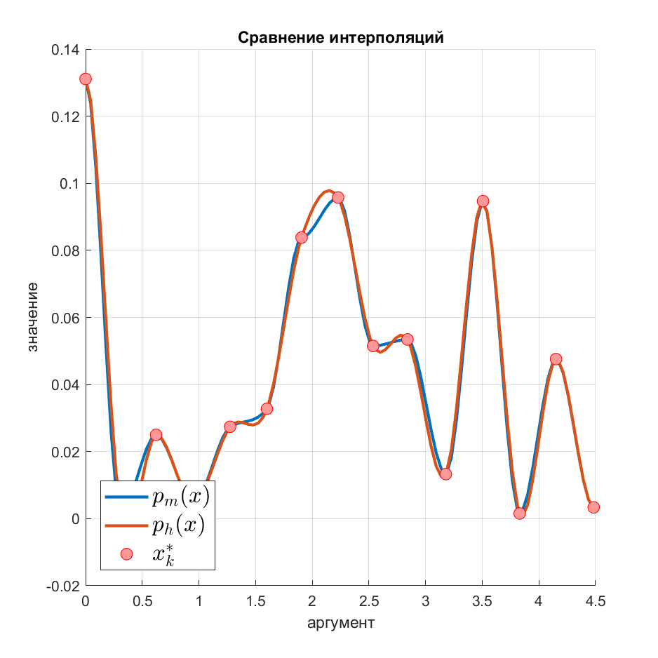

## Демо-приложение быстрого поиска изоморфных подграфов

В данном репозитории размещен пример подключения алгоритма монотонной кубической 
интерполяции. 

Монотонная интерполяция кубическими полиномами с помощью алгоритма,
описанного в [статье](https://epubs.siam.org/doi/10.1137/0717021)
Fritsch, F. N.; Carlson, R. E. (1980). "Monotone Piecewise Cubic Interpolation".
SIAM Journal on Numerical Analysis. SIAM. 17 (2): 238–246.



Чтобы подключить библиотеку, нужно добавить репозиторий в файл `pom.xml`: 

```xml
   <repositories>
        <repository>
            <id>buran-center</id>
            <url>https://mvn.buran.center/releases</url>
        </repository>
    </repositories>
```

Также необходимо подключить саму зависимость:

```xml
    <dependencies>
        <dependency>
            <groupId>center.buran.fast</groupId>
            <artifactId>patterns</artifactId>
            <version>1.0-SNAPSHOT</version>
        </dependency>
    </dependencies>
```
